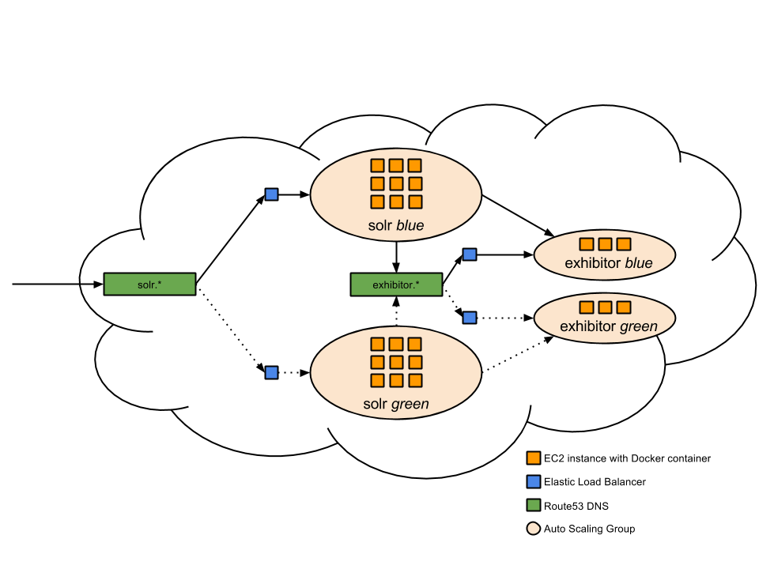

# SolrCloud appliance for STUPS

Appliance for running a SolrCloud on the [STUPS](https://stups.io/) infrastructure.

## Table of contents
1. SolrCloud appliance overview
2. Bootstrap SolrCloud appliance
3. Blue/green deployment of new SolrCloud appliance version

## 1 SolrCloud appliance overview

## 2 Bootstrap SolrCloud appliance

1. Deploy a Zookeeper (exhibitor) ensemble using the [exhibitor-appliance](https://github.com/zalando/exhibitor-appliance) for STUPS.

2. Build Solr

        $ docker build -t <tag> .

3. Smoke test Solr locally

        $ docker run -p 8983:8983 -p 8778:8778 --net=host -e "ZK_API=http://localhost:8181" -v /data -it <tag>

4. Push to Docker registry

        $ pierone login
        $ docker push <tag>

5. Deploy and bootstrap Solr cloud to AWS with [solrcloud-cli](https://github.com/zalando/solrcloud-cli).

## 3 Blue/green deployment of new SolrCloud appliance version
**Important:** Stop import of new data during deployment in order to not loose data in case one shards becomes
unavailable or something else happens during deployment.

1. Build new Solr version

        $ docker build -t <tag> .

2. Smoke test new Solr version locally

        $ docker run -p 8983:8983 -p 8778:8778 --net=host -e "ZK_API=http://localhost:8181" -v /data -it <tag>

3. Push to Docker registry

        $ pierone login
        $ docker push <tag>

4. Deploy new Solr version to inactive stack (green or blue) on AWS with [solrcloud-cli](https://github.com/zalando/solrcloud-cli).
